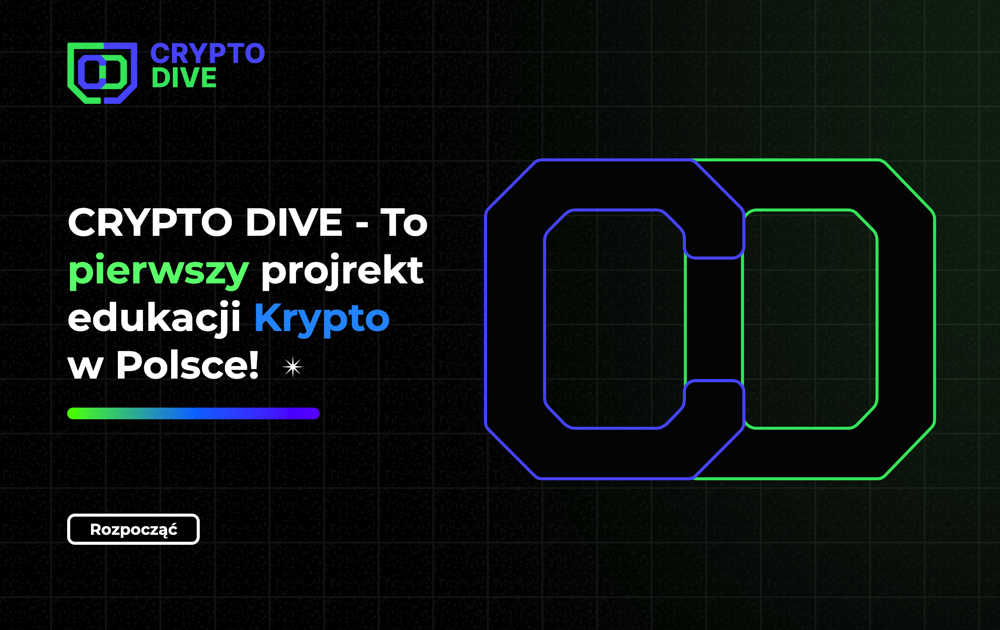
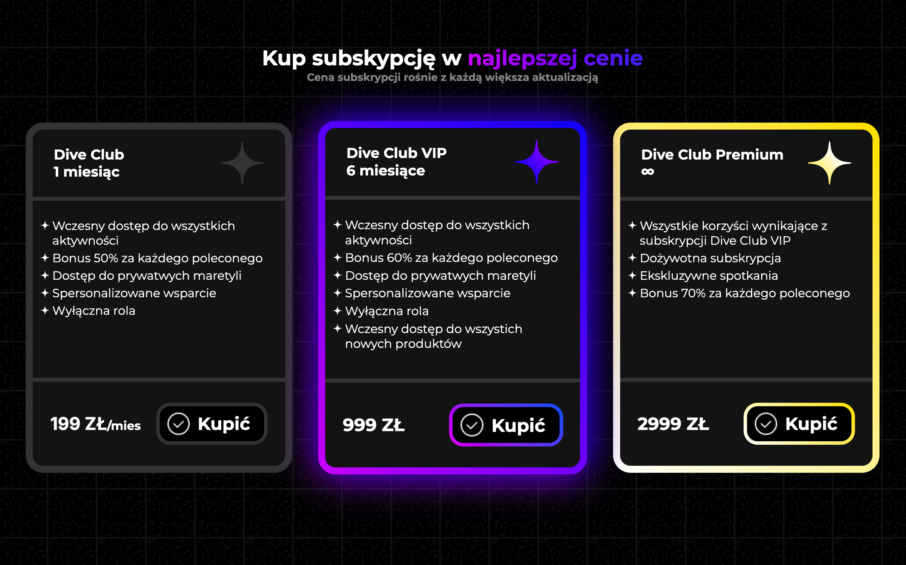

<div align="center">
<h3>Crypto Dive</h3>
<p>

[](#)

</p>
</div>
Landing page for Crypto Dive ecosystem. Crypto Dive is a platform that provides a comprehensive range of cryptocurrency-related content, including news, events, testing, and educational resources.

> [!NOTE]
> This repository only has a demo version containing the frontend solution.

## 🎥 Demo

### Main page



### Offer page



## 🚀 Getting Started

1. Clone the repository:

```bash
git clone https://github.com/dobrohor/Crypto-Dive.git
```

2. Go to `client` folder.

```bash
cd client
```

3. Install dependencies.

```bash
npm install
```

4. Run the following command.

```Bash
npm run dev
```

5. Open your browser and navigate to `http://localhost:5173/` to see the app in action.
